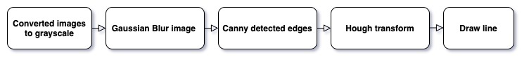

# Self-Driving Car Finding Lane Lines

Build a software pipeline to identify and track the position of the lane lines in a video stream.

### Table of Contents

1. [Project Motivation](#motivation)
2. [File Descriptions](#files)
3. [Run](#results)
4. [Licensing, Authors, and Acknowledgements](#licensing)

## Project Motivation<a name="motivation"></a>
Using Canny edge detection and Hough transforms to find lane lines in images. the pipeline consisted of 5 steps.  



## File Descriptions <a name="files"></a>

```
- Finding_lane_lines_on_the_Road.ipynb  # research file
- writeup.md  # the project report
- README.md   # the project readme
```

## Run <a name="results"></a>

```
pip install opencv-python
```
or
```
pip install opencv-contrib-python
```

```
jupyter notebook
```

## Licensing, Authors, and Acknowledgements <a name="licensing"></a>

### Built With
* [OpenCV](https://opencv.org/) - OpenCV is a highly optimized library with focus on Computer vision.

### Versioning

* We use [SemVer](http://semver.org/) for versioning. For the versions available, see the [tags on this repository](https://github.com/your/project/tags).

### Authors

* **Tom Ge** - *Data egineer* - [github profile](https://github.com/tomgtqq)

### License

* This project is licensed under the MIT License
