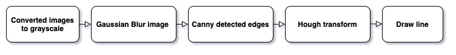
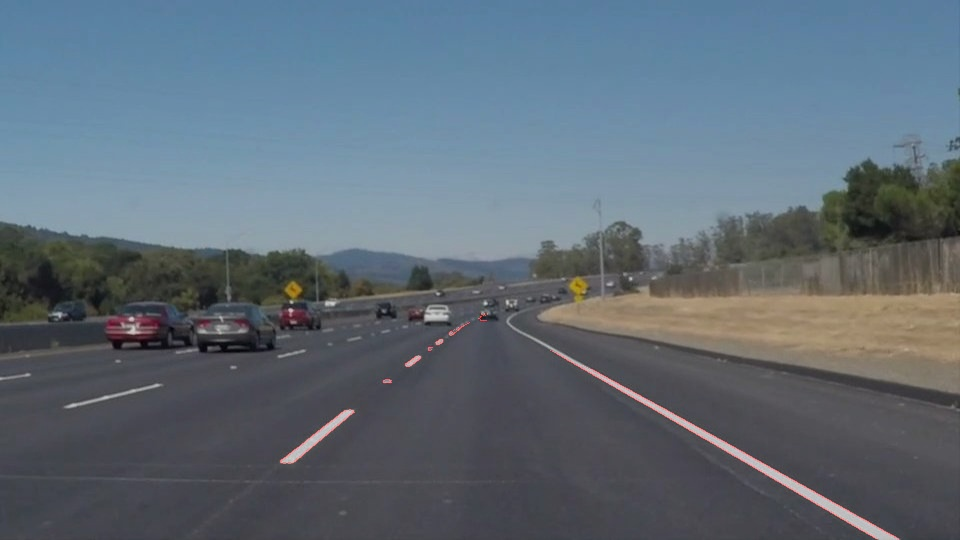
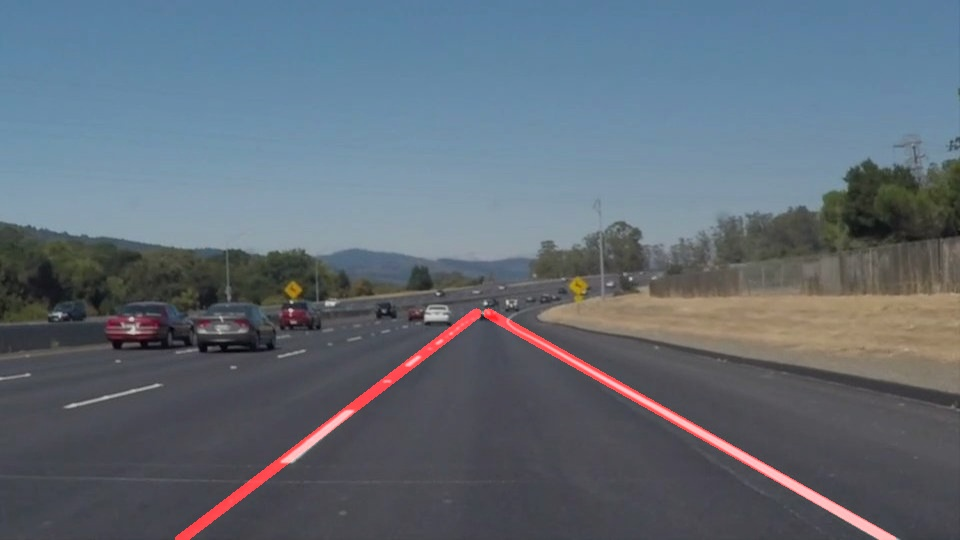

# **Finding Lane Lines on the Road** 

The goals / steps of this project are the following:
* Make a pipeline that finds lane lines on the road
* Reflect on your work in a written report

[//]: # (Image References)

[image1]: ./examples/grayscale.jpg "Grayscale"

---

### Reflection

### 1. Describe your pipeline. As part of the description, explain how you modified the draw_lines() function.

My pipeline consisted of 5 steps. First, I converted the images to grayscale, then I blur the image to reduce image noise. So the image reinforces the main features. So I can detected edges by Canny funciton. And finally I use hough transformed the image and drew the line.

In order to draw a single line on the left and right lanes, I modified the draw_lines() function by left lines points collection and right lines points collection. I split by the line slop. So I can apply **np.ployfit** on the points collection to find  **y=mx+b** coefficient. Finally, I take interesting area endpoints to Polynomial. So I have the endpoints on both ends of this line segment.

If you'd like to include images to show how the pipeline works, here is how to include an image: 

### 2. Identify potential shortcomings with your current pipeline

One potential shortcoming would be We can't find current lane lines when a car more ap in the region of interest. 

Another shortcoming could be If there are complex Lane lines on the road. We can't find the correct driving path.

### 3. Suggest possible improvements to your pipeline

A possible improvement would be to use multiple cameras to capture images from different locations.
